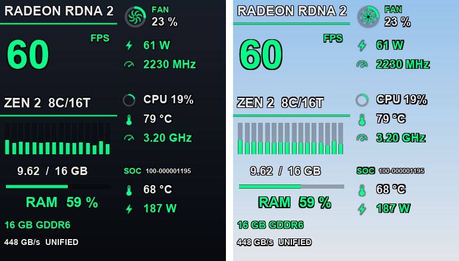

# ps5-hud-overlay

[](LICENSE)
[](https://github.com/erickdavestech/ps5-hud-overlay/releases/latest)
[](https://github.com/erickdavestech/ps5-hud-overlay/actions/workflows/ci.yml)

On-screen **performance HUD and DualSense controller overlay** for a PlayStation 5 running homebrew.
A single payload runs entirely on the console. While a game runs, it draws two overlays at the same
time:

- **Performance panel (top-left):** current FPS, power, temperatures, fan, CPU, GPU and RAM, read live
  from the console.
- **DualSense controller (bottom-left):** buttons, sticks, triggers and touchpad light up in real time.

> Educational project about PS5 homebrew, process injection and the system UI (`SceShellUI`,
> PUI on Mono). Use it only on hardware you own and read the [legal notice](#legal-notice).

**[Download the latest release](https://github.com/erickdavestech/ps5-hud-overlay/releases/latest)**

## Preview



<sub>Layout preview rendered on a PC from the panel artwork, with illustrative values. On the console
the text uses the system font.</sub>

## Download

Get `ps5-hud-overlay-<version>.elf` from the
[latest release](https://github.com/erickdavestech/ps5-hud-overlay/releases/latest). The release also
includes `SHA256SUMS.txt` to verify the file.

## Features

### Performance panel

The panel uses two columns: the left one for the GPU, CPU and memory, the right one for the fan, power,
clocks and temperatures.

| Metric | What it shows | Source |
|---|---|---|
| FPS | Frames per second presented by the game | Display controller flip counter |
| GPU | Power (W) and graphics clock (MHz) | SoC power rails, SoC clock domain |
| CPU | Load (%), temperature (°C), clock (GHz) and the load of each of the 16 threads | Kernel sensors and idle-thread time |
| Fan | Duty (%), with an animated fan whose speed follows the duty | Kernel fan duty |
| SoC | Part number, temperature (°C) and total power (W) | `hw.model`, SoC sensor, power rails |
| RAM | Used / total system memory in GB, with a bar and a percentage | System memory pools and the game's resident pages |

- Every value is measured on the console; nothing is estimated. A metric that cannot be read shows
  `--`.
- No panels or boxes are drawn behind the data. Each text has a thin black outline, so it stays
  readable over bright and dark scenes without hiding the game.
- Pinned to the top-left corner. Its size is derived from the scene size, and the system scales the
  scene to the output resolution, so the panel keeps its proportions at 1080p and 4K.
- Recovers on its own after Rest Mode.

[docs/TELEMETRY.md](docs/TELEMETRY.md) explains how each metric is read and how it was verified.

### DualSense overlay

The controller overlay comes from [ps5-dualsense-overlay](https://github.com/erickdavestech/ps5-dualsense-overlay)
v1.0.1:

- Every functional button lights up: ✕ ○ △ □, D-pad, L1/R1, L2/R2, L3/R3, Create, Options and the
  touchpad click.
- Sticks follow the axes and show a color ring when moved or clicked.
- L2/R2 show an analog fill proportional to the pressure, and the touchpad shows a dot under the finger.
- Semi-transparent, placed bottom-left, sharp at 4K and scaled with the scene.

### Both overlays

- Load once per boot. The payload waits for a game, appears when one opens and rebuilds itself when you
  switch games.
- System applications and dialogs are never treated as games.
- The payload never attaches to, reads or writes the game process.

## Compatibility

| Console | System software | Status |
|---|---|---|
| PS5 Slim (CFI-2015) | 13.60 (13.600.007) | Tested |
| PS5 | 11.xx – 13.50 | Allowed by the code, not tested |
| PS5 | 10.xx and earlier | Code paths inherited from upstream, not tested with this overlay |

Tested with kstuff-lite, loading the `.elf` through the payload manager's web portal. Other homebrew
enablers may work but have not been tested.

The sensor functions are looked up at run time. If a system software version lacks one of them, only
that metric shows `--`.

## Usage

1. Jailbreak the console as usual (tested with kstuff-lite).
2. Load `ps5-hud-overlay-<version>.elf` with your payload manager in either of these ways:
   - **Web portal:** from a PC or phone on the same network, open the payload manager's portal using
     the console's local IP and upload the `.elf`.
   - **USB:** copy the `.elf` to a USB drive, connect it to the console and launch it from the payload
     manager.
3. Open any game. The panel appears in the top-left corner and the controller in the bottom-left
   corner.

Load it only **once** per boot. Do not run it together with ps5-dualsense-overlay, Common FPS or
SimpleFPS: they all inject into the same system process and use the same IPC port. This payload already
contains the DualSense overlay. To update, reboot and load the new version.

## Troubleshooting

| Symptom | Cause and fix |
|---|---|
| Nothing appears | The overlays only draw while a game is in the foreground. Open a game. |
| *System Software Error* right after loading | A second copy was loaded on top of a running one, or another overlay from the same family is also running. Reboot and load only this payload, once. |
| A metric shows `--` | The sensor is not available on this system software, or the payload is starting up. FPS retries automatically with a growing delay. |
| The PS button never lights up | Expected. The system intercepts it before any application can read it. |
| The Mute button never lights up | Expected. It is disabled, see [Known limitations](#known-limitations). |

Logs can be read with a shell payload such as shsrv:

- **Renderer:** `/system_tmp/hudoverlay_shellui.log`. It is capped at 12 KB because `/system_tmp` is
  tiny.
- **Controller:** `/data/CommonFPS_v1_2_1.log`. It is capped at 512 KB and prints a `Perf sample` line
  every minute.

## Known limitations

- **GPU load (%):** there is no system function that reports it, so it is not shown.
- **Fan RPM:** there is no system function that reports it, so the fan shows its duty (%) instead.
- **PS button:** intercepted by the system to open the Control Center; it cannot be read.
- **Mute button:** the controller only reports the momentary press, not the microphone state, so the
  button stays disabled.
- **Power:** the system refreshes the power rails about every 5 seconds, so watts update at that pace.
- The overlay positions and sizes are fixed.
- Only one system software version has been tested on hardware.

## How it works

1. **Controller:** a payload waits until a real game is running and the system UI is stable, then
   injects a **renderer** into `SceShellUI`. System applications and dialogs are filtered out by title
   ID.
2. **Telemetry:** the controller samples the sensors twice per second on its own main thread and
   sends a 96-byte packet to the renderer over UDP loopback. Every source is read-only and none of them
   touches the game process.
3. **Renderer:** it hooks the UI update loop (`Application.Update`, with the legacy main-thread guard
   as a fallback). It draws `ImageBox` sprites and `Label` text in the game's scene and reads the
   DualSense with `scePadReadState`. Text and bar updates happen only when a value changes.
4. **Assets:** the images are embedded in the payload and written to `/Temp` at startup.
   `SceShellUI` cannot read `/data`, and loading `file:///data/...` hard-hangs the console.
5. **Lifecycle:** when the game scene changes, the old widgets are removed and both overlays are
   rebuilt. After Rest Mode, the controller notices the jump in wall-clock time and resynchronizes the
   telemetry.

On system software 11.xx–13.xx the one-byte hook writes go through MDBG, with a temporary RWX remap of
every code page involved.

## Building from source

See [BUILDING.md](BUILDING.md).

## Project layout

```text
src/ps5/shellui_payload/   renderer injected into SceShellUI (panel, controller, input)
src/ps5/                   controller payload (game detection, injection, telemetry, IPC)
include/common_fps/        shared protocol and data types, including the telemetry packet
assets/                    controller artwork; assets/perf/ holds the panel artwork
tools/                     artwork pipelines, etaHEN plugin packer, release verifier
probe/                     controller input research from ps5-dualsense-overlay
tests/                     host tests
docs/                      telemetry notes, preview image and the upstream Common FPS documentation
```

## Authorship

This repository is a derivative work of [Common FPS for PS5](https://github.com/porhe911/Common-FPS-for-PS5)
by **porhe911**, including the [SimpleFPS](https://github.com/khalifa007/SimpleFPS) patch by
**khalifa007** that enables system software 11.xx–13.xx. Their work provides the injection, the hook
infrastructure and the build system. The DualSense overlay comes from ps5-dualsense-overlay by the
same author as this project.

**Original work in this project, by erickdavestech:**

- **Performance panel renderer:** two-column layout, outlined text, rings, fan animation, thread and
  RAM bars, scene-based scaling and change-gated updates.
- **Console telemetry** (`perf_telemetry`):
  - FPS from the display controller, with a guarded buffer and retry with backoff;
  - CPU, SoC and fan sensors, CPU load per thread from idle-thread time, GPU clock and power rails;
  - total system RAM;
  - optional sensor functions looked up at run time;
  - Rest Mode resynchronization.
- **Telemetry packet and its IPC path** from the controller to the renderer.
- **Controller loop:** a single process scan per second, stability gates for the system UI and the
  game, injection retries and a bounded event log.
- **Merging** of the DualSense overlay and the panel into one renderer, with a renderer log capped
  for `/system_tmp`.
- **Panel artwork pipeline** (`tools/build_perf_assets.py`) and its embedded sprite tables.

Each source file states its authors in its license header. The complete credits are in
[CREDITS.md](CREDITS.md) and [THIRD_PARTY_NOTICES.md](THIRD_PARTY_NOTICES.md). Every change is listed in
[CHANGELOG.md](CHANGELOG.md).

## Contributing

Read [CONTRIBUTING.md](CONTRIBUTING.md) and the [Code of Conduct](CODE_OF_CONDUCT.md) first. Report
security problems privately as described in [SECURITY.md](SECURITY.md).

## License

- **Source code:** **GPL-3.0-or-later** — see [LICENSE](LICENSE). It inherits this license from Common
  FPS for PS5 and SimpleFPS.
- **Controller artwork:** **"PS5 Button Icons and Controls" by Zacksly**, licensed **CC BY 3.0**
  (https://zacksly.itch.io) and modified — see
  [`assets/source/LICENSE.txt`](assets/source/LICENSE.txt).
- **Panel artwork:** generated by `tools/build_perf_assets.py`, GPL-3.0-or-later.

Every file keeps its copyright header and SPDX license identifier.

## Legal notice

- PlayStation, PS5 and DualSense are trademarks or registered trademarks of Sony Interactive
  Entertainment Inc. AMD, Radeon and Zen are trademarks of Advanced Micro Devices, Inc. This project is
  not affiliated with, authorized, sponsored or endorsed by Sony Interactive Entertainment or AMD.
- No Sony code, firmware, encryption keys, official SDK or game content is included. The project is
  built with the open-source PS5 payload SDK.
- This project does not contain or distribute any exploit, jailbreak or copy-protection circumvention
  tool, and it does not enable running unauthorized copies of software. It only runs on a console on
  which its owner has already enabled homebrew.
- Modifying a console may void its warranty and break the platform's terms of service. Use it offline
  and at your own risk.
- The software is provided "as is", without warranty of any kind, as stated in the GPL-3.0.
